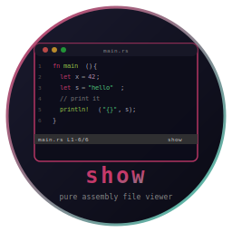
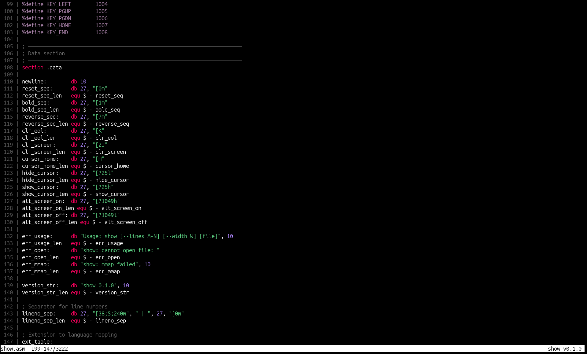

# show - Pure Assembly File Viewer



     

File viewer with syntax highlighting, written in x86_64 Linux assembly. No libc, no runtime, pure syscalls. Single static binary, 38KB.

A less/cat/bat replacement. Three modes: full-screen pager, cat-style output, and embeddable pane output for TUI applications.

<br clear="left"/>

## Install

```bash
git clone https://github.com/isene/show.git
cd show
make
sudo make install
```

## Usage

```bash
show file.rb              # full-screen pager (if stdout is a terminal)
show file.py | grep def   # cat mode with colors (if stdout is a pipe)
echo "hello" | show       # pipe mode (reads stdin)
show --lines 10-30 file.c # pane mode (for embedding in TUI apps)
```

## Screenshot



## Key Bindings (Pager Mode)

| Key | Action |
|-----|--------|
| j / Down | Scroll down one line |
| k / Up | Scroll up one line |
| Space / PgDn | Page down |
| b / PgUp | Page up |
| g / Home | Go to top |
| G / End | Go to bottom |
| l | Toggle line numbers |
| Left / Right | Horizontal scroll |
| q | Quit |

## Syntax Highlighting

20+ languages with keyword, type, function, string, comment, number, and operator coloring:

| Language | Extensions |
|----------|-----------|
| Assembly | .asm, .s |
| C/C++ | .c, .h, .cpp, .hpp, .cc |
| C# | .cs |
| Forth | .fth, .4th, .forth |
| Go | .go |
| Java | .java |
| JavaScript/TypeScript | .js, .ts, .jsx, .tsx |
| Julia | .jl |
| Lua | .lua |
| Python | .py |
| Ruby | .rb, .gemspec |
| Rust | .rs |
| Shell | .sh, .bash, .zsh, .fish |
| XRPN | .xrpn |
| JSON | .json |
| YAML | .yaml, .yml |
| TOML | .toml |
| Markdown | .md |
| Config | .conf, .cfg, .ini |

Shebang detection: files without extensions are identified by `#!/...ruby`, `#!/...python`, etc.

## Color Scheme

| Element | Color |
|---------|-------|
| Keywords | Hot pink (197) |
| Strings | Green (78) |
| Comments | Gray (242) |
| Numbers | Purple (141) |
| Types | Cyan (81) |
| Functions | Yellow-green (148) |
| Operators | Light gray (248) |
| Line numbers | Dark gray (240) |

Colors match the [pointer](https://github.com/isene/pointer) file manager's built-in highlighter.

## Modes

**Pager mode** (default when stdout is a terminal): full-screen with scrolling, status bar, and line numbers. Uses alternate screen buffer.

**Cat mode** (when stdout is a pipe): outputs all lines with syntax highlighting and line numbers. Works like `bat` or `cat` with colors.

**Pane mode** (`--lines M-N`): outputs a specific line range with highlighting. No raw mode, no key handling. Designed for embedding in TUI applications like [pointer](https://github.com/isene/pointer) and [RTFM](https://github.com/isene/RTFM).

## Part of CHasm (CHange to ASM)

| Tool | Purpose | Binary | Suite |
|------|---------|--------|-------|
| **[show](https://github.com/isene/show)** | **File viewer** | **38KB** | **CHasm** |
| [bare](https://github.com/isene/bare) | Interactive shell | 130KB | CHasm |

## License

[Unlicense](https://unlicense.org/) - public domain.

## Credits

Created by Geir Isene (https://isene.org) with pair-programming with Claude Code.
